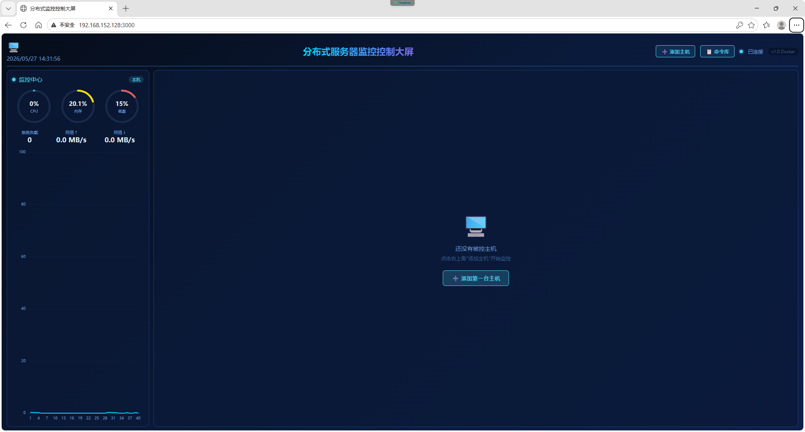
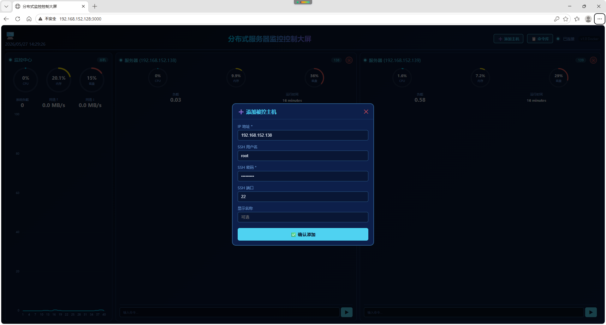
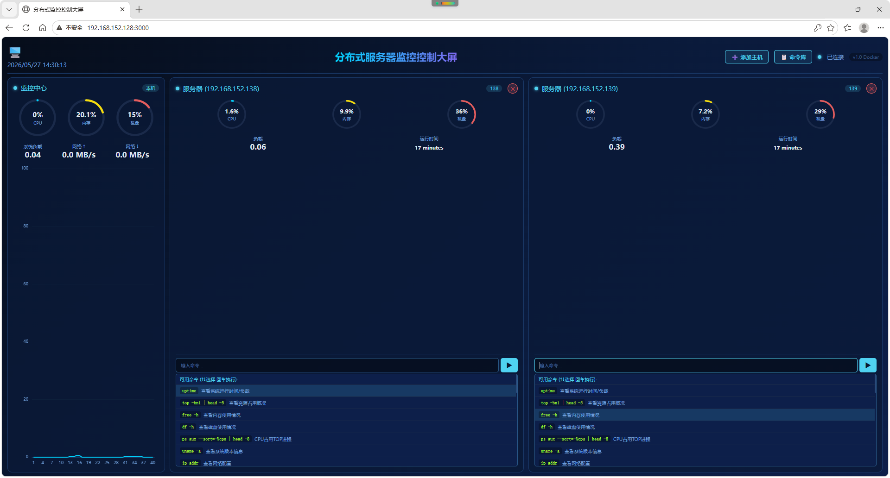

# 🖥️ 分布式服务器监控控制大屏

**一个基于 Vue3 + FastAPI + Docker 的轻量级服务器实时监控与远程控制系统**

---

## 📑 目录

1. [系统简介](#系统简介)
2. [核心特性](#核心特性)
3. [系统架构](#系统架构)
4. [技术栈](#技术栈)
5. [快速开始](#快速开始)
6. [功能说明](#功能说明)
7. [API文档](#api文档)
8. [配置说明](#配置说明)
9. [常见问题](#常见问题)

---

## 系统简介

这是一个基于 **Vue3 + FastAPI** 开发的轻量级分布式服务器监控与控制系统。与常规监控系统不同的是，本项目在提供美观的实时数据大屏的同时，**深度集成了远程命令控制功能**，能够通过大屏直接对任意被控主机执行预设或自定义的Linux命令，实现监控与管理的闭环。

系统支持 **Docker容器化一键部署**，后端通过 Paramiko (SSH) 采集被控主机数据，前端纯手写CSS/JavaScript实现所有可视化效果（环形仪表盘、趋势图、命令提示框），非常适合作为毕业设计、课程作业或运维看板。

### 适用场景

- 📺 **期末作业/课程设计**：全栈技术实践，业务逻辑完整，可视化效果好
- 🖥️ **运维监控看板**：Docker一键部署，实时查看多台服务器的CPU、内存、磁盘状态
- 🎮 **轻量级运维工具**：统一Web入口，安全地对多台服务器执行命令
- 🌐 **跨网段管理**：支持添加与监控机不同网段的被控主机（需网络可达）
- 🐳 **容器化学习**：完整的 Docker Compose 编排示例

---

## 核心特性

### 🎯 主要功能

#### 1. 实时监控指标
- ✅ **CPU使用率**：精确到0.1%，SVG环形仪表盘实时更新
- ✅ **内存使用率**：环形仪表盘展示，每2秒刷新
- ✅ **磁盘使用率**：根分区空间占用监控
- ✅ **网络速度**：本机实时上传/下载速度（MB/s）
- ✅ **系统负载**：实时负载数据展示
- ✅ **在线状态感知**：自动检测并醒目提示被控主机的在线/离线状态

#### 2. 监控大屏
- 📺 **自适应多列布局**：被控主机列数根据添加数量动态增长，底部横向滚动
- 🔄 **2秒实时刷新**：WebSocket推送本机及所有远端主机聚合数据
- 📊 **多维度可视化**
  - 监控中心面板：CPU/内存/磁盘环形图 + 网络流量 + CPU趋势折线图
  - 被控主机列：每台主机独立显示环形图 + 系统负载 + 运行时间
  - 全局命令弹窗：8大类40+条命令，分类展示，支持一键执行

#### 3. 远程命令控制（核心亮点）
- ➕ **动态添加主机**：界面输入IP、用户名、密码即可添加，无需修改配置文件
- ⌨️ **智能命令提示**：点击输入框自动弹出分类命令列表，支持键盘↑↓选择
- 🔍 **实时命令过滤**：输入关键词实时过滤匹配命令
- ▶️ **一键执行与反馈**：SSH远端执行，结果实时返回黑色终端区域
- ✂️ **动态移除主机**：动态添加的主机列可一键移除

#### 4. 命令管理
- 📚 **预置命令库**：8大类别、40+条常用命令
  - 系统状态、网络相关、服务管理、Docker相关、文件与磁盘、日志查看、用户相关、系统操作
- 🗂️ **全局命令弹窗**：分类展示所有命令及说明，每条命令为每台在线主机提供一键执行按钮
- ✏️ **自定义命令**：支持执行任意Linux命令

#### 5. 部署方式
- 🐳 **Docker一键部署**：`docker compose up -d --build` 即可启动
- 🔧 **前后端分离**：前端Nginx静态服务，后端FastAPI API服务
- 🤖 **Agent支持**：提供轻量级Python Agent，可部署在被控节点上

---

### 系统架构

```text
监控控制中心 (Docker)
│
├── Vue 3 前端 (Nginx) :3000
│   ├── 监控中心面板
│   ├── 被控主机列（动态）
│   ├── 命令提示弹窗
│   └── 添加主机弹窗
│
├── FastAPI 后端 :8000
│   ├── RESTful API
│   ├── WebSocket 实时推送
│   ├── SSH 远程执行
│   └── 动态主机管理
│
└── 通信方式
    ├── WebSocket ──► 每2秒推送本机及远端主机数据
    └── HTTP POST ──► 远程控制命令

         │
         │ Paramiko (SSH)
         ▼

被监控服务器集群
├── 192.168.152.138 (Web服务器)
├── 192.168.152.139 (数据库服务器)
└── Agent :9100 (可选，轻量级采集服务)
```


**架构说明：**

| 组件               | 说明                                               |
| :----------------- | :------------------------------------------------- |
| Vue 3 前端 (Nginx) | 大屏展示界面，负责数据可视化与用户交互             |
| FastAPI 后端       | 核心业务逻辑，提供 API、WebSocket、SSH 远程执行    |
| WebSocket          | 每 2 秒向前端推送本机及所有远端主机的实时数据      |
| Paramiko (SSH)     | 通过 SSH 协议采集被控主机指标并执行远程命令        |
| Agent (可选)       | 轻量级 Python 服务，可部署在被控节点上提供指标接口 |

## 系统截图





## 工作流程

1. **动态挂载**：用户在 Web 界面输入主机信息，后端通过 API 动态添加到监控列表。
2. **实时采集**：后端通过 Paramiko (SSH) 执行 `top`、`free`、`df` 等命令，采集被控主机的 CPU、内存、磁盘数据。
3. **数据推送**：后端通过 WebSocket 每 2 秒将本机及所有远端主机的聚合数据推送给前端。
4. **前端渲染**：Vue 3 接收数据，驱动所有环形图和趋势图实时更新。
5. **交互控制**：用户在大屏上选择命令，前端通过 HTTP API 将指令发送给后端，后端通过 SSH 在远端执行并返回结果。

------

### 技术栈

**后端技术**

| 技术     | 版本  | 用途                                        |
| :------- | :---- | :------------------------------------------ |
| Python   | 3.10  | 主要编程语言                                |
| FastAPI  | 0.109 | 高性能 Web 框架，提供 REST API 与 WebSocket |
| Uvicorn  | 0.27  | ASGI 服务器                                 |
| Paramiko | 3.4   | SSH 客户端，用于远程命令执行和数据采集      |
| psutil   | 5.9   | 本机系统资源监控                            |

**前端技术**

| 技术        | 版本 | 用途                                 |
| :---------- | :--- | :----------------------------------- |
| Vue 3       | 3.4+ | 渐进式前端框架，采用 Composition API |
| Vite        | 5.4  | 前端构建工具                         |
| Axios       | 1.7  | HTTP 客户端                          |
| ECharts     | 5.5  | 数据可视化图表库（CPU 趋势图）       |
| 纯 CSS/HTML | -    | 手写大屏样式、SVG 环形图、弹窗组件   |

**基础设施**

| 技术           | 用途                    |
| :------------- | :---------------------- |
| Docker         | 容器化部署              |
| Docker Compose | 容器编排                |
| Nginx          | 前端静态服务与 API 代理 |
| Ubuntu 20.04   | 操作系统                |

------

### 快速开始

**前置要求**

- 已安装 Docker 与 Docker Compose（v2 及以上版本）
- 被监控服务器需开放 SSH 端口（默认 22）

**Docker 一键部署**

```bash
# 进入项目目录
cd monitor-dashboard

# 构建并启动所有服务
docker compose up -d --build

# 查看运行状态
docker compose ps

# 查看实时日志
docker compose logs -f
```

### 添加第一台主机

1. 点击右上角 `➕ 添加主机`
2. 填写信息：
   - **IP地址**：被监控服务器的IP
   - **SSH用户名**：默认 root
   - **SSH密码**：登录密码
   - **SSH端口**：默认 22
   - **显示名称**：可选
3. 点击 `✅ 确认添加`，大屏自动增加一列，开始实时监控

------

## 功能说明

### 1. 监控中心面板

- 固定展示本机（Docker宿主机）的CPU/内存/磁盘环形图
- 网络实时上传/下载速度
- CPU使用率历史趋势折线图（ECharts，最近40个数据点）

### 2. 被控主机面板

- **动态添加**：表单输入即可创建新列，无需修改配置文件
- **实时指标**：每台主机独立显示CPU/内存/磁盘环形图、系统负载、运行时间
- **在线状态**：在线/离线指示灯，一目了然
- **命令执行区**：
  - 智能命令提示（聚焦自动弹出）
  - 实时搜索过滤
  - 键盘↑↓选择，回车执行
  - 黑色终端区域实时显示执行结果
- **移除按钮**：动态添加的主机右上角 ✕ 按钮可一键移除

### 3. 全局命令库弹窗

- 8大类别、40+条预置命令
- 每条命令显示名称和用途说明
- 为每台在线主机提供彩色一键执行按钮

------

## API文档

### 主机管理

| 方法 | 路径                  | 说明             |
| :--- | :-------------------- | :--------------- |
| GET  | `/api/servers`        | 获取所有主机列表 |
| POST | `/api/servers/add`    | 动态添加主机     |
| POST | `/api/servers/remove` | 移除指定主机     |

### 命令管理

| 方法 | 路径            | 说明                   |
| :--- | :-------------- | :--------------------- |
| GET  | `/api/commands` | 获取所有可用命令及分类 |
| POST | `/api/control`  | 执行远程命令           |

### 实时数据

| 方法      | 路径  | 说明                           |
| :-------- | :---- | :----------------------------- |
| WebSocket | `/ws` | 实时推送本机及所有远端主机数据 |

### 系统状态

| 方法 | 路径          | 说明     |
| :--- | :------------ | :------- |
| GET  | `/api/health` | 健康检查 |

------

## 配置说明

### Docker Compose 配置

编辑 `docker-compose.yml` 可修改：

- 前端端口映射（默认 `3000:80`）
- 后端端口映射（默认 `8000:8000`）
- 时区设置（默认 `Asia/Shanghai`）

### 命令库配置

编辑 `backend/config.py` 中的 `COMMON_COMMANDS` 字典，可自由增删预置命令。

### 采集间隔

编辑 `backend/config.py` 中的 `COLLECT_INTERVAL`（默认2秒）。

------

## 常见问题

### 1. 端口被占用

bash

```
# 查看端口占用
lsof -i :3000
lsof -i :8000

# 修改 docker-compose.yml 中的端口映射
```


### 2. 添加主机后显示"离线"

- 检查网络：`ping` 被控主机IP
- 检查SSH：`ssh root@IP` 测试凭据
- 检查防火墙：确保22端口开放

### 3. Docker容器无法访问宿主机网络

- 确保容器网络模式正确
- 检查被控主机是否在可达网络中

### 4. 命令提示不弹出

- 确认后端服务正常运行
- 检查浏览器控制台是否有报错

## 项目亮点

- ✅ **纯自研可视化组件**：SVG环形图、深蓝科技风大屏，未使用第三方UI库
- ✅ **监控+控制一体化**：不仅"看"，更能"管"，真正实用的运维工具
- ✅ **Docker一键部署**：前后端容器化，一条命令启动
- ✅ **动态扩展**：界面添加主机，列数自动增长，无需重启
- ✅ **智能命令提示**：聚焦弹出、输入过滤、键盘选择，交互体验好
- ✅ **跨网段支持**：灵活适配复杂网络环境